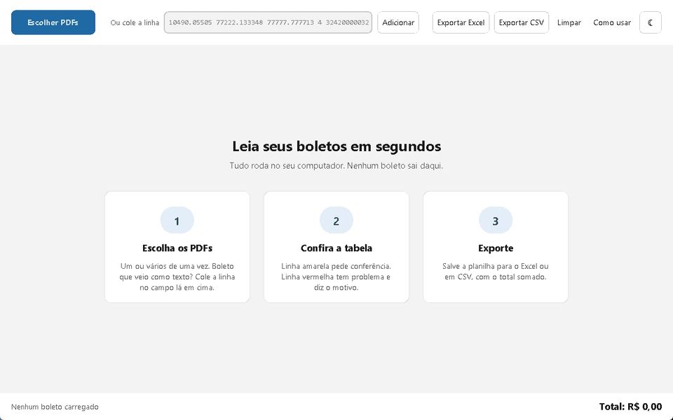
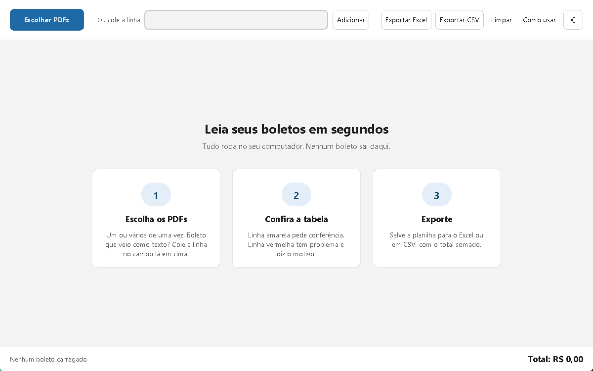
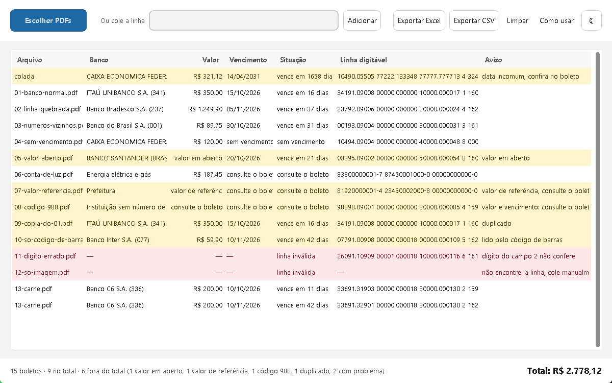
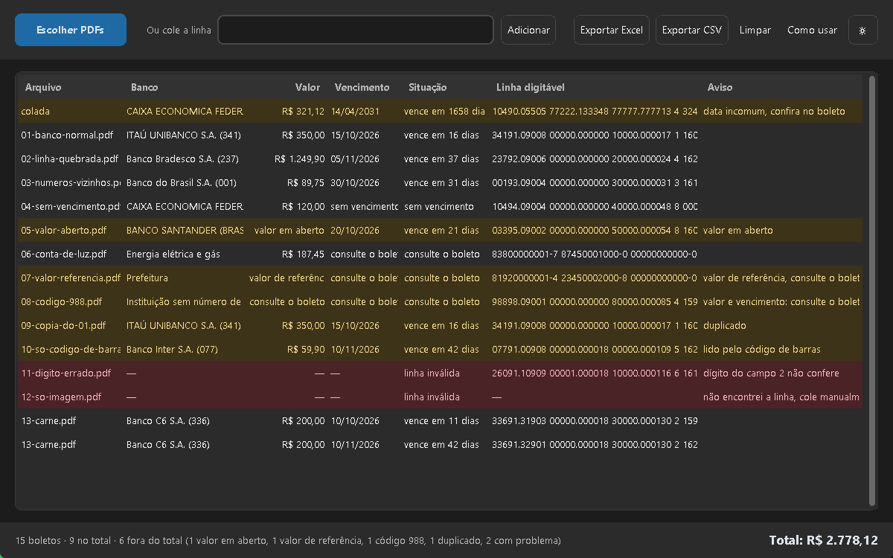
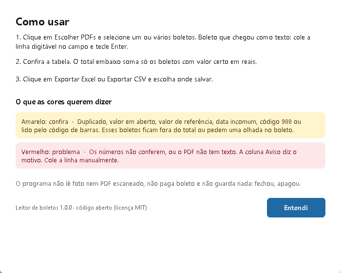

# Leitor de boletos

Programa para Windows que **lê boletos em PDF e monta uma planilha com banco, valor e vencimento
de cada um**. Você escolhe os arquivos, confere a tabela e exporta para o Excel, sem digitar nada.



Tudo roda no seu computador: sem servidor, sem conta, sem internet e sem IA. O boleto nunca sai
da máquina.

## Como usar

1. Baixe o `LeitorDeBoletos-1.0.0.zip` na página de [Releases](../../releases), extraia a pasta
   e abra o `LeitorDeBoletos.exe` que está dentro dela. Não precisa instalar nada.
2. Clique em **Escolher PDFs** e selecione um ou vários boletos. Boleto que chegou como texto
   (e-mail, WhatsApp): cole a linha digitável no campo e tecle Enter.
3. Confira a tabela:
   - **amarelo** pede conferência (duplicado, valor em aberto, data incomum...);
   - **vermelho** indica problema e diz o motivo.
4. Clique em **Exportar Excel** ou **Exportar CSV**.

| Início | Com boletos |
|---|---|
|  |  |

| Tema escuro | Como usar |
|---|---|
|  |  |

## Como funciona

O boleto segue o padrão da FEBRABAN. A **linha digitável**, a sequência de números impressa no
boleto, já carrega os dados; o programa só calcula. Exemplo, com uma linha publicada no manual
oficial da Caixa:

```
10490.05505 77222.133348 77777.777713 4 32420000032112
```

| Trecho | Significado |
|---|---|
| `104` | código do banco (Caixa Econômica Federal), buscado na lista oficial do Banco Central |
| `0000032112` | valor em centavos: **R$ 321,12** |
| `3242` | fator de vencimento: dias contados a partir de uma data-base |
| último dígito de cada bloco e o `4` isolado | **dígitos de conferência**: se a linha foi lida errado, a conta não fecha |

**Princípio do projeto: nunca mostrar dado errado com cara de certo.** Quando algo não confere,
o programa avisa em vez de chutar.

## Os casos difíceis que o programa trata

Cada um tem teste automático.

| # | Caso | O que o programa faz |
|---|---|---|
| 1 | O fator de vencimento chegou a 9999 em 21/02/2025 e recomeçou do 1000 | Considera as duas datas possíveis e escolhe a mais próxima de hoje; avisa se ficar a mais de 1 ano |
| 2 | Boleto sem vencimento no código (fator 0000) | Mostra "sem vencimento", nunca uma data inventada |
| 3 | Boleto de valor em aberto (valor zero) | Mostra "valor em aberto" e não soma no total |
| 4 | Conta de luz, água ou imposto (48 dígitos) | Lê o valor; o vencimento não tem lugar fixo no código, então pede para consultar o boleto |
| 5 | Um dígito lido ou digitado errado | Marca a linha como inválida e diz qual parte não conferiu |
| 6 | Linha quebrada, com pontos e espaços | Limpa antes de ler |
| 7 | Outros números compridos no PDF (CNPJ, nosso número) | Só aceita a sequência que passa na conferência |
| 8 | O mesmo boleto carregado duas vezes | Avisa e soma uma vez só |
| 9 | Conta de consumo cujo número não é valor em reais | Mostra "valor de referência" e não soma |
| 10 | Instituição sem número de banco próprio (código 988) | Não interpreta o campo como valor e data; pede para consultar o boleto |

Também aceita o **código de barras** (44 dígitos) quando o PDF não traz a linha digitável, lê
PDFs cujo texto vem com a fonte codificada e aceita um PDF com vários boletos (carnê).

## O que o programa não faz

- Não lê foto nem PDF escaneado: sem texto no PDF, ele pede para colar a linha.
- Não lê o nome do beneficiário nem nota fiscal.
- Não paga, não agenda e não consulta banco.
- Não guarda nada: fechou o programa, a tabela some.

**Limites conhecidos:**
- boleto acima de R$ 99.999.999,99 e boleto "à vista" não se distinguem pela linha;
- vencimento em fim de semana ou feriado aparece como está no boleto;
- conta de consumo não traz vencimento confiável no código.

## Privacidade

Nenhum dado sai do computador. O código não usa internet. Nenhum boleto real está neste
repositório: os exemplos da pasta `exemplos/` são fictícios, gerados por script, e cada um traz
o selo "exemplo fictício".

## Aviso do Windows

Ao abrir o `.exe` pela primeira vez, o Windows pode mostrar **"O Windows protegeu o
computador"**. Isso acontece com programas sem assinatura digital, que é paga. Para abrir, clique
em **Mais informações** e depois em **Executar assim mesmo**.

Alguns antivírus podem acusar o programa por **falso positivo**. É comum em programas Python
empacotados com o PyInstaller, que os detectores automáticos confundem com programas
suspeitos. O programa não acessa a internet nem mexe no sistema: só lê os PDFs que você escolhe
e grava a planilha onde você mandar.

Para conferir que o arquivo é o original, compare o hash SHA-256 publicado junto com cada
versão:

```
Get-FileHash LeitorDeBoletos-1.0.0.zip -Algorithm SHA256
```

Quer uma segunda opinião? Envie o arquivo ao [VirusTotal](https://www.virustotal.com) antes de
abrir. Como o código é aberto, também dá para ler tudo o que o programa faz e rodar direto pelo
código-fonte (abaixo).

## Rodar pelo código-fonte

Precisa do Python 3.12 ou mais novo.

```
python -m venv .venv
.venv\Scripts\python -m pip install -r requirements.txt
.venv\Scripts\python iniciar.py
```

Testes:

```
.venv\Scripts\python -m pip install -r requirements-dev.txt
.venv\Scripts\python -m pytest
```

Gerar o `.exe`: `powershell -ExecutionPolicy Bypass -File scripts\gerar_exe.ps1`.

## Tecnologias

Python · pdfplumber (leitura de PDF) · CustomTkinter (janela) · openpyxl (Excel) · pytest
(testes) · PyInstaller (executável).

## Licença

Código sob a licença [MIT](LICENSE).

A lista de bancos (`src/leitor_boletos/dados/bancos.csv`) vem da Lista de Participantes do STR do
Banco Central do Brasil, sob a Open Database License (ODbL). Detalhes em
`src/leitor_boletos/dados/LICENCA-bancos.txt`.
